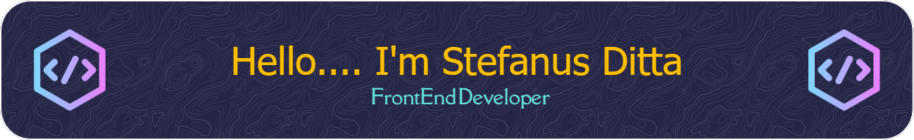

# 💫 About Me:
I work at one of the largest minimarket companies in Indonesia, focusing on front-end development for both internal and external financial websites. I'm experienced in using React JS and Vue to build clean, responsive user interfaces. I also have hands-on experience with Laravel and CodeIgniter for fullstack development needs. When it comes to styling, Tailwind CSS is my go-to because of its flexibility and speed 🚀. I'm always eager to explore new technologies and build web experiences that are not just functional, but also delightful to use ✨.

## 🌐 Socials:
    

# 💻 Tech Stack:
            
# 📊 GitHub Stats:
 
 

### ✍️ Random Dev Quote

<!-- Proudly created with GPRM ( https://gprm.itsvg.in ) -->

<h2 align="left">Let's Play Game With Me 🎮</h2>

<picture>
  <source media="(prefers-color-scheme: dark)" srcset="https://raw.githubusercontent.com/stefanusd/stefanusd/output/pacman-contribution-graph-dark.svg">
  <source media="(prefers-color-scheme: light)" srcset="https://raw.githubusercontent.com/stefanusd/stefanusd/output/pacman-contribution-graph.svg">
  
</picture>

###